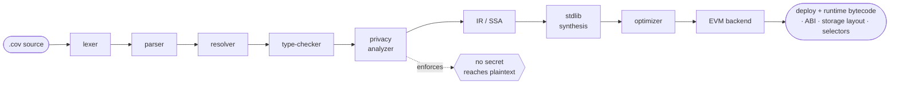

<div align="center">

# Covenant

### Covenant Language · <sub>*"Covenant" for short*</sub>

**A declarative smart-contract language that makes cryptographic guarantees first-class.**

Write `token`, `nft`, `registry`, `ceremony`, the compiler synthesizes the audited-shape surface and lowers it to EVM bytecode. No inheritance. Guards live in the signature. A privacy type system tracks secrets at compile time.

<br>

[](CHANGELOG.md)
[](https://github.com/Valisthea/covenant-language/actions/workflows/ci.yml)
[](#testing)
[](LICENSE)
<br>
[](STATUS.md)
[](STATUS.md)
[-F59E0B?style=flat-square)](#security--audits)
[](https://kairos-lab.org)
[](https://x.com/Valistheaeth)

[**Website**](https://covenant-lang.org) · [**Playground**](https://playground.covenant-lang.org) · [**Milestones**](MILESTONES.md) · [**Changelog**](CHANGELOG.md) · [**Honest status**](STATUS.md)

[**Security and audit roadmap**](docs/security-and-audit-roadmap.md) · [**Deploying to an Orbit chain**](docs/orbit-adoption.md) · [**Review archive**](https://github.com/Valisthea/covenant-security-reviews)

</div>

---

> [!WARNING]
> **Testnet only. The cryptographic primitives are MOCKED.**
> FHE / post-quantum / ZK / VDF / Shamir are **deterministic stubs**, testnet-gated. They provide **zero** confidentiality and **zero** cryptographic security, "encrypted" values are readable from chain state, and the PQ / ZK verifiers accept forged proofs. **Do not deploy to mainnet or place real value at risk.** Real cryptography plus an external audit are a separate, later release. See **[STATUS.md](STATUS.md)** for the full, honest breakdown.

## Why Covenant

Solidity gives you a low-level machine and asks you to assemble a safe contract from primitives every time. Covenant flips it: you **declare what the contract is**, and the compiler generates the surface.

|  | Solidity | Covenant |
|---|---|---|
| **Model** | imperative; inherit `ERC20`, override carefully | declarative; `token X { … }` synthesizes the surface |
| **Guards** | `modifier onlyOwner` you can forget to attach | `only deployer, given bps <= 500`, part of the signature |
| **Privacy** | none at the type level | a **compile-time privacy / key-identity type system** tracks secrets and refuses to leak them |
| **Tests** | separate framework | in the source: `covenant test`, stripped from release builds |

The privacy type system is the genuinely novel part, and it is **real, today, without any cryptography running.**

## A token in five lines

```covenant
token KairosCoin {
    symbol:   "KRC"
    name:     "Kairos Coin"
    decimals: 18
    supply:   1_000_000_000_000_000_000_000_000 to deployer
}
```

That compiles to a full, conformant ERC-20, `transfer` / `approve` / `transferFrom` / `balanceOf` / `allowance` / `totalSupply`, the `Transfer` / `Approval` events with canonical topic hashes, and standard 4-byte selectors, indistinguishable to wallets, explorers and indexers from a hand-written Solidity token. Add `burn`, an opt-in transfer fee, or any custom action inline; the `nft`, `registry` and `ceremony` keywords work the same way.

## How it compiles



Twenty-one Rust crates, one deterministic pipeline. Same source, same bytes, verified: two independent builds and the on-chain runtime of the milestone token all hash to the same SHA-256.

## What's real vs what's mocked

The whole point of the honest-status discipline is that this table is never buried.

| Layer | State today |
|---|---|
| ✅ **Compiler** (lex → parse → resolve → type-check → privacy → IR → EVM) | real, tested, deterministic |
| ✅ **Compile-time privacy / key-identity types** | real, the novel core, true without crypto |
| ✅ **Auto-synth** ERC-20 / ERC-721 / PQ-registry from ~5 lines | real, deployed & exercised on-chain |
| ✅ **Ceremony state machine** (`CeremonyHelper`) | real 4-phase lifecycle |
| ✅ **Tooling**, CLI, LSP, linter, editor plugins | real |
| 🔴 **FHE** (`MockedFHEHelper`) | plaintext store; "encrypted" values readable on-chain |
| 🔴 **Post-quantum** (`MockedPQVerifier`) | parity check, accepts ~50% of forgeries |
| 🔴 **ZK** (`MockedZKVerifier`) | coin-flip; verifies nothing |
| 🔴 **VDF / Shamir** | keccak commitment / share-count only |

Every mock carries a `PLACEHOLDER` banner and an `onlyTestnet` modifier. Real implementations are the **V2.0, Cryptography** track.

## Milestones: externally verifiable

Not a proof of concept. Real contracts, real transactions, on two independent public chains ([full record](MILESTONES.md)).

| # | What | Chain | Address |
|---|---|---|---|
| M0 | First Covenant contract | Sepolia | [`0xab083fc4…`](https://sepolia.etherscan.io/address/0xab083fc4922d34a799ca0f8f70711e1454018671) |
| M1 | First `ceremony` lifecycle (setup → destroy) | Sepolia | [`0x2FB87d54…`](https://sepolia.etherscan.io/address/0x2FB87d54D66c5fAEc1257a1A834497572fCe916D) |
| M2 | First auto-synth ERC-721 NFT | Sepolia | [`0xf8d9895c…`](https://sepolia.etherscan.io/address/0xf8d9895cc265886d958841af8d9a6469be94bc25) |
| M5 | First PQ key registry | Sepolia | [`0xb9c5a5d8…`](https://sepolia.etherscan.io/address/0xb9c5a5d874fa1797d8cfbbe7292051d9227eb1d3) |
| M6 | First contract beyond Sepolia (`token` + burn + fee) | Robinhood Chain | [`0x3E80F8c7…`](https://explorer.testnet.chain.robinhood.com/address/0x3E80F8c7911240e6092D523af79B13c046bd2FdE) |

No public explorer can verify Covenant source (Blockscout offers 8 methods, all Solidity/Vyper), so we built our own: **[playground.covenant-lang.org/verify](https://playground.covenant-lang.org/verify)** recompiles your `.cov` in the browser and compares it byte-for-byte to the deployed code.

## Quick start

Requires Rust `stable` (pinned in `rust-toolchain.toml`).

```bash
# Build the compiler
cargo build --release --bin covenant

# Compile a contract
./target/release/covenant build examples/kairos_coin.cov --out ./out
#   → out/KairosCoin.bin  .runtime.bin  .abi.json  .storage.json  .metadata.json

# The rest of the Foundry-class toolchain
covenant check <file>     # type-check, no codegen
covenant test  <file>     # run in-source test blocks
covenant fmt   <file>     # format
covenant lint  <file>     # 21-detector security linter
covenant doctor           # environment probes
```

Prefer the browser? The **[playground](https://playground.covenant-lang.org)** runs the compiler as WASM, edit, compile, simulate on an in-tab EVM, or deploy to a testnet with MetaMask.

## Architecture

Twenty-one crates, single workspace, Apache-2.0.

```
Frontend    lexer · parser · resolver · types · privacy
Middle      ir (SSA) · opt
Backends    evm-backend · wasm-backend · aster-backend (deprecated)
Stdlib      stdlib (ERC-20/721/8227/8231 + amnesia synthesis)
Tooling     cli · lsp · lint · diag · driver · manifest · testing · circuits
Runtime     evm-runtime (mini-EVM for tests) · wasm-bindings (playground)
```

`nft` / `token` / `registry` / `ceremony` and friends are compiler keywords, not imported libraries, the synthesis happens at compile time, so there is no base contract to forget or override wrong.

## Security & audits

- **Self-audited, not third-party.** OMEGA V4 / V5 / V6 are Kairos-Lab internal adversarial audits. The unqualified word *"audited"* is deliberately **not** used, an external firm audit is the gate for V1.0.
- **The audits keep finding things, which is the honest signal.** V0.9.2 fixed a **Critical** ERC-721 authorization bypass (anyone could move any NFT). V0.9.3 (OMEGA V6) fixed **6 Critical + 6 High + 5 Medium**. V0.9.4 is a **fail-loud pass**: seven classes of *silent miscompile*, `max(a,b)` returning `a+b`, `x/0` returning `0`, test actions shipping on-chain, field defaults dropped, now error or work correctly. **One was found by the fuzzer.** ([CHANGELOG](CHANGELOG.md) · [review archive](https://github.com/Valisthea/covenant-security-reviews))
- **Continuous fuzzing** (`cargo-fuzz`) on the compile pipeline; every crash it finds is checked into the corpus as a permanent regression seed.

Found something? See [SECURITY.md](SECURITY.md).

## Releases

Semantic-ish versioning; pre-release tags for research milestones. Full detail in [CHANGELOG.md](CHANGELOG.md).

| Version | Theme |
|---|---|
| [**0.9.4**](CHANGELOG.md) | **Fail-loud pass**, silent miscompiles error or work; live LSP diagnostics; green CI |
| [0.9.3](CHANGELOG.md) | OMEGA V6 self-audit, 6 Critical + 6 High + 5 Medium |
| [0.9.2](CHANGELOG.md) | Full-audit resolutions, Critical ERC-721 auth fix + High codegen defects |
| [0.9.0](CHANGELOG.md) | Helper-contract bridge live on Sepolia · `nft` / `registry` / `interface` |
| [0.8.0](CHANGELOG.md) | GA, WASM backend · amnesia ceremony · cross-chain bridge |
| [0.7.0](CHANGELOG.md) | GA, spec frozen · OMEGA V4 audit (41 findings) |

## Roadmap

Three axes, deliberately decoupled, see [STATUS.md](STATUS.md).

| Milestone | Meaning | Horizon |
|---|---|---|
| **Public launch** | open-source, honest, **testnet-only** language & compiler | current |
| **V1.0** | + external third-party audit of compiler + `CeremonyHelper` | +3 to 5 months |
| **V2.0, Cryptography** | real FHE / PQ / ZK / VDF / Shamir + a crypto audit | 12 to 24 months |

## Standards

The Styx Protocol ERC specs are **Draft standards authored by Kairos Lab**: **ERC-8227** (Encrypted Token), **ERC-8228** (Cryptographic Amnesia), **ERC-8229** (FHE Computation Verification), and **ERC-8231** (Post-Quantum Key Registry). The amnesia ceremony maps to **ERC-8228** (Cryptographic Amnesia), exactly as the confidential token maps to ERC-8227.

## License

| What | License |
|---|---|
| Compiler & tooling (all `crates/`, helpers) | [Apache-2.0](LICENSE) |
| Specifications & example `.cov` | [CC0-1.0](examples/LICENSE), public domain |

Full component split, SPDX identifiers, and trademark terms in **[LICENSING.md](LICENSING.md)**.

**On FHE technology:** Covenant is a *language*, FHE operations are delegated to chain-side precompiles. It **does not implement, depend on, or bundle any FHE library** (neither Zama's `tfhe-rs` nor any other); the architecture is scheme-agnostic. Full IP position and deployment guidance in [LICENSE_CLARIFICATION.md](LICENSE_CLARIFICATION.md).

---

<div align="center">

**Developed by [Kairos Lab](https://kairos-lab.org)** · [@Valisthea](https://x.com/Valistheaeth) · [covenant-lang.org](https://covenant-lang.org)

*Testnet-only · cryptography mocked · internally self-audited · not for production or real value.*

</div>
